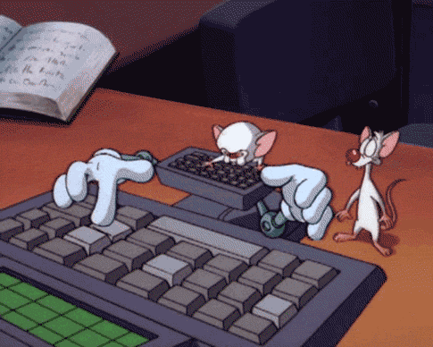

# Becode Template for JavaScript Exercises

[Githubpage](https://raigyo.github.io/bootstrap-corporate/)

# Bootstrap Exercice - Innovation.io

Here you will create individually a website using [Bootstrap](https://getbootstrap.com/). The goal is to practise HTML and web design in a corporate environment, using Bootstrap as a tool to facilitate that goal.

## The pitch

You want to create a website for your new, revolutionnary, startup: **Innovation.io**. You don't have anything to sell right now and no ideas about what you could do as a business but your clients do not need to know that information. You just need to create a killer website to explain that your company will change the world.

## Requirements

* The website must be using [Bootstrap](https://getbootstrap.com/) and use as much as possible the features coming from it. (Like panels, forms, buttons, images, etc...) Custom CSS should be limited as much as possible. Please take a look at the Bootstrap's documentation.
* It should not use a default Bootstrap, you must use a template. If starting from [becode-js-web-template](https://github.com/becodeorg/becode-js-web-template) you **have to** change the Bootstrap template it already contains (Litera) by another one. You are of course completely free to create a completely new template by yourself (it's really hard to do it well but if you want...) or to alter an existing one.
* Your HTML files should **never** contain duplicated code. (If using [becode-js-web-template](https://github.com/becodeorg/becode-js-web-template) you can solve this issue easily by using Nunjucks.)
* **Your website must look professionnal**. That's the whole purpose of the exercise. Consider that you truelly succeed it if you can convince someone outside the class that your website is a real company website.
* Your website must be **fully responsive**. You must test it using Chrome's devtools to emulate a phone then by using your real phone.

## Pages & Components

### Navbar & common design

Your website must contain a navigation bar as well as a footer, both containing links to each pages of the website. They must remain unchanged on all pages.

### Front page

The front page should contain:

* A full-page-width carousel showing multiple images illustrating the values of your company with inspiring messages (use stock photos that look like enterprise, at least 3 photos)
* A quote of one of your clients explaining how happy he is to work with you. You should also display his face. (Take and use a photo of someone else in the classroom.)
* Something else. Be imaginative but not too much. Take a look at what other startups put on their front page as an inspiration and do the same.

### Team page

Here you should display a list of all the persons in the company. No serious startup has less than 5 persons involved. (We don't say they *work*, but they are listed on the team page.)
* Use the card component of Bootstrap to display your team.
* Write at least the name and the role of the person.
* Use photos of other persons in the classroom for your team page.  

### Contact page

In the contact page you must display a contact form for your future clients to contact you. (It doesn't have to be functional but it must look like it is.)

Insert also practical informations about your company : address, business hours and a google map.

## Additionnal Requirements

* **It must look professionnal**.
* **It must be fully responsive**.

Yeah, we already said that. It's just to be sure you really understand.

## Have fun and conquer the world  

